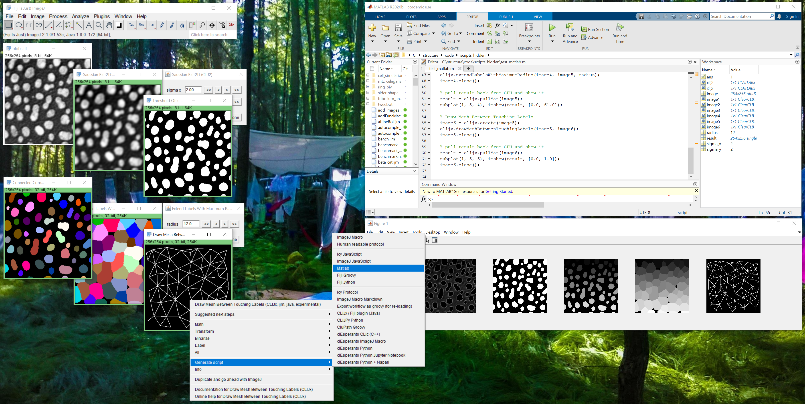

# clatlabx
 
clatlabx is a bridge between 
[Matlab](https://de.mathworks.com/products/matlab.html) and 
[clijx](https://clij.github.io/clijx), 
the eXperimental sibling of [clij2](https://clij.github.io/clij2).

For scripting clatlabx it's recommended to use [CLIJx-assistant](https://clij.github.io/assistant)
and its matlab code generator



## Installation
Download the following files and put them all in the `<HOME_DIR>/Documents/MATLAB folder:
* [clatlabx-0.30.1.14-jar-with-dependencies.jar](https://github.com/clij/clatlabx/releases/download/0.30.1.14/clatlabx-0.30.1.14-jar-with-dependencies.jar)
* [init_clatlabx.m](https://github.com/clij/clatlabx/blob/master/src/main/matlab_install/init_clatlabx.m)

Test the installation by executing this script from matlab:
```
clijx = init_clatlabx();
% print out name of used GPU:
clijx.getGPUName()
```

## Example code
Examples are available in the [clatlabx](https://github.com/clij/clatlab/) repository. 

## How to develop clatlabx
Clone this repository and build it using maven. Afterwards, you find the `clatlabx.jar` in the `target` directory. 
Copy it to your clatlab/matlab java classpath.

```bash
git clone https://github.com/clij/clatlabx
cd clatlabx
mvn package
cp target/clatlabx*.jar classpath/
```

[Back to CLIJ documentation](https://clij.github.io/)

[Imprint](https://clij.github.io/imprint)
